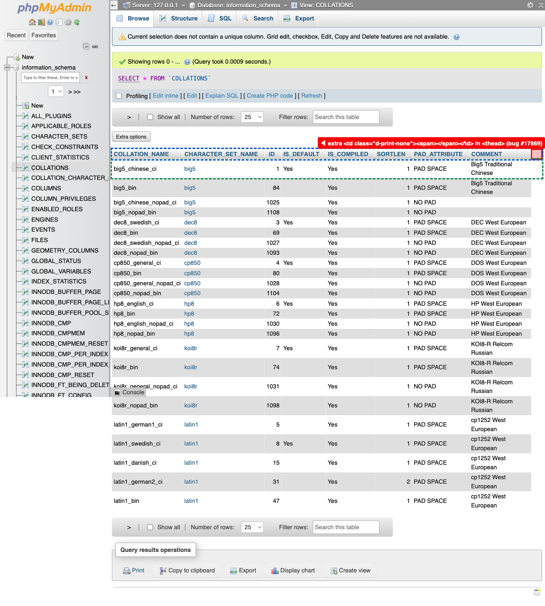
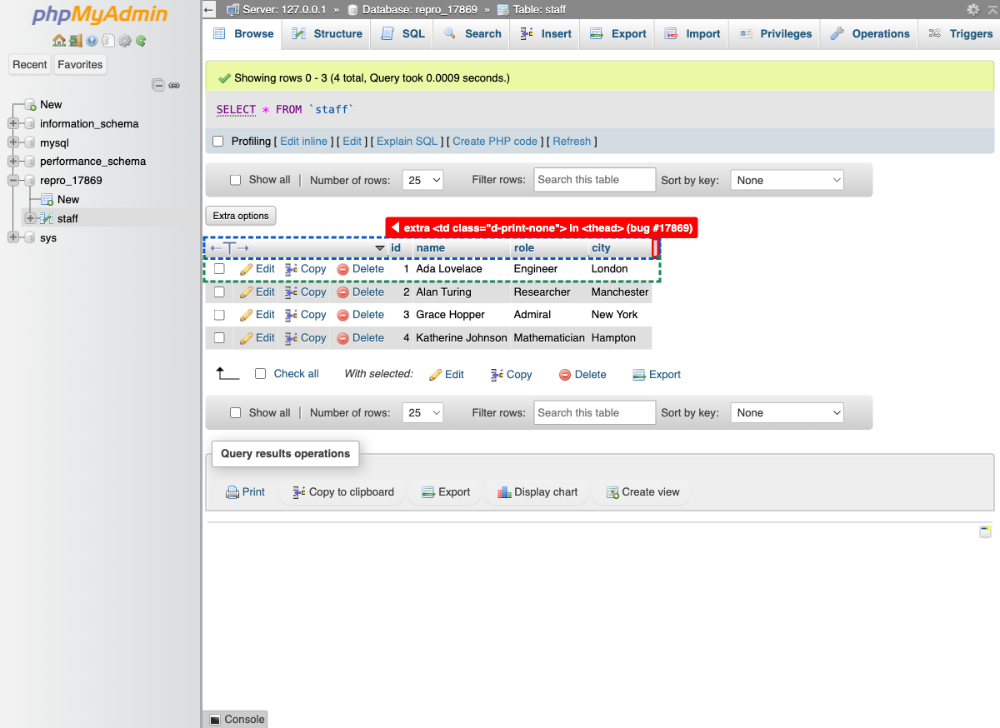
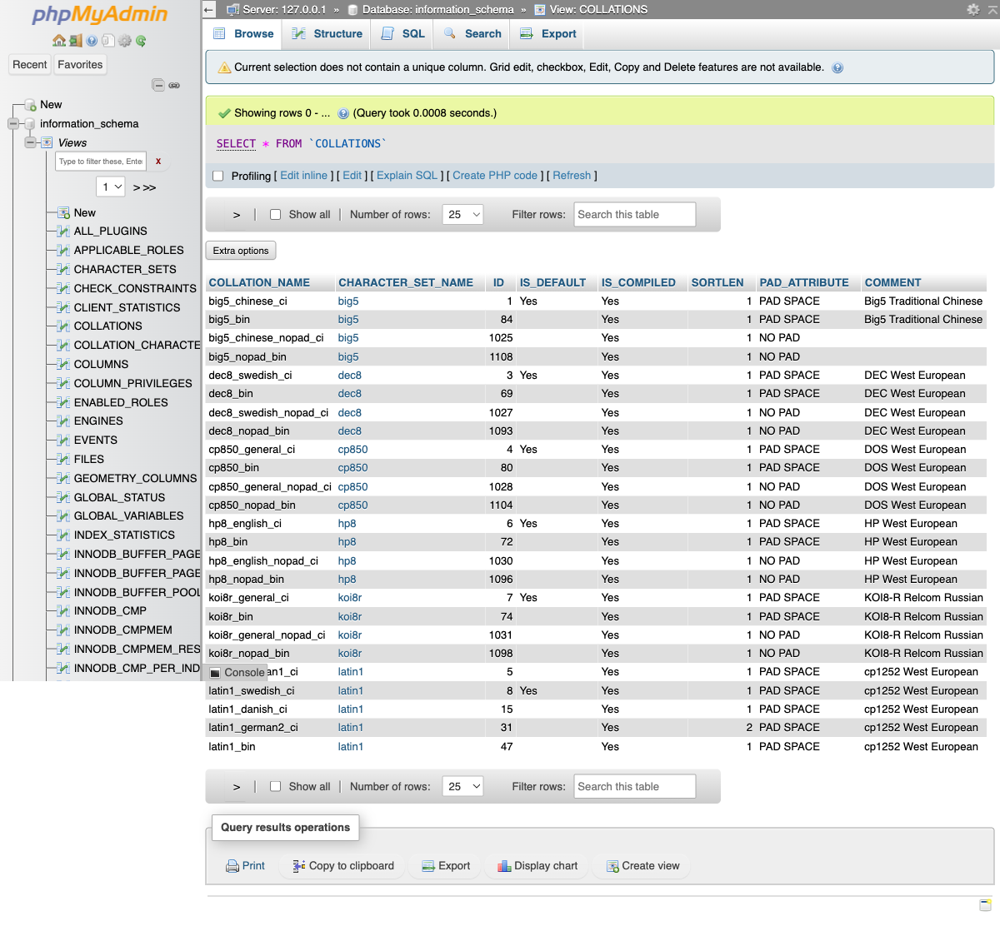

# Contribution 1: Extra table header cell incorrectly added

**Contribution Number:** 1  
**Tech Fellow:** Matthew Wyatt  
**Issue:** https://github.com/phpmyadmin/phpmyadmin/issues/17869  
**Status:** Phase III Complete

---

## Why I Chose This Issue

I chose this issue because it's about fixing a well-scoped, self-contained bug in phpMyAdmin, a mature and widely-used open source tool for administering MySQL and MariaDB databases over the web. The bug is concrete and verifiable: an extra, empty cell is incorrectly rendered in a table header, so I can reproduce it visually, trace it back to the rendering logic, and confirm a fix without needing deep prior knowledge of the entire codebase. That makes it an ideal first contribution.

It also lines up well with what I want to learn. Tracking down the bug means working through phpMyAdmin's PHP and Twig-based table-rendering code, and fixing it properly means adding regression test coverage so the extra cell can't reappear. This will allow me to demonstrate the skills (reading an established codebase, debugging UI/rendering output, and writing meaningful tests) I'm hoping to build through this contribution.

---

## Understanding the Issue

### Problem Description

When browsing the rows of a table in phpMyAdmin (Browse mode), the results table's header row ends up with one more cell than each of the data rows below it. An extra, empty utility cell is rendered at the right edge of the header only, which leaves the header misaligned with the body. It was reported against phpMyAdmin 5.2.0 and is also confirmed on the 6.0.x branch; tracing the code through git history shows the empty placeholder cell has been present at least since phpMyAdmin 3.5.0 and was originally introduced all the way back in March 2002, so this is a long-standing bug rather than a recent regression. There is a second related defect in the same code path (see what I did there?): the stray cell is emitted as a `<td>` inside `<thead>`, which is invalid table markup! Header rows should only contain `<th>` cells.

### Expected Behavior

The header row should have exactly the same number of columns as the body rows so that every column label lines up with its data. A right-side action/utility column should appear in the header only when a matching cell also appears in each body row, and every cell in the header should be a `<th>` element.

### Current Behavior

In Browse mode an extra empty cell (`<td class="d-print-none">…</td>`) is appended to the right end of the header row, but no corresponding cell exists in the body rows, so the header ends up one column wider. The original reporter saw the cell rendered as `<td class="d-print-none"></td>` and suspected the active theme was the cause, since it did not reproduce on the public demo server. On closer inspection, the extra cell is controlled by the `$cfg['RowActionLinks']` configuration setting (default `'left'`) rather than the theme: when row action links are placed on the left, and there are no edit/delete links to display, the code still emits an empty placeholder column on the right side of the header.

### Affected Components

The bug lives in `libraries/classes/Display/Results.php`: `getColumnAtRightSide()` builds the right-hand header column (its output becomes `headers.column_at_right_side`, which `templates/display/results/table.twig` concatenates into the `<thead>`). Its sibling `getFieldVisibilityParams()` builds the left column the same way. The trigger is the default `$cfg['RowActionLinks'] = 'left'` (`libraries/config.default.php`), and `test/classes/Display/ResultsTest.php` asserts on the header output, so it needs updating alongside the fix.

---

## Reproduction Process

### Environment Setup

I ran phpMyAdmin locally on macOS on the **QA_5_2** branch (5.2.4-dev), since the issue was reported against 5.2.0. Homebrew supplied the toolchain (PHP 8.5, Composer, Yarn); `composer install` and `yarn install` pulled and built dependencies; and the database was a Dockerized MariaDB container (`root`/`root` on port 3306). After copying `config.sample.inc.php` to `config.inc.php` with a generated `blowfish_secret`, I served the app with `php -S localhost:8000 -t .` (on 5.2 the web root is the repo root) and logged in as `root`. Two snags worth noting: `composer install` first failed on a git "bare repository" safety error while cloning a dependency, which I cleared with a one-off `GIT_CONFIG_*` override (no global git config change); and login failed until I set the server host to `127.0.0.1`, forcing a TCP connection to the container instead of a unix socket. Running PHP 8.5 against a 5.2-era codebase also surfaces deprecation notices, but core functionality worked with no fatal errors.

**Working branch:** https://github.com/MatthewOscar/phpmyadmin/tree/fix/17869-extra-table-header-cell

### Steps to Reproduce

Using the local 5.2.4-dev setup above (stock configuration, so `$cfg['RowActionLinks']` is its default `'left'`):

1. Log in to phpMyAdmin at http://localhost:8000 as `root` / `root`.
2. Open any table in **Browse** mode. I confirmed it on two:
   - `information_schema.COLLATIONS` — a read-only system view with no unique key, so no Edit/Copy/Delete row actions are shown.
   - A hand-made `repro_17869.staff` table with a primary key, so Edit/Copy/Delete row actions *are* shown.
3. Inspect the rendered results table (`table.table_results`) and compare the `<thead>` row against any `<tbody>` row (browser devtools, or the JS check in the evidence below).

**Observed result:** the header row carries one extra cell on its right edge that has no counterpart in the body rows, so the header is wider than the data. The extra cell is rendered as a `<td>` *inside* `<thead>`, which is also invalid table markup.

- On **`information_schema.COLLATIONS`**: the header has **9** cells vs **8** in each body row — exactly one extra — and the stray cell is `<td class="d-print-none"></td>`, matching the original bug report verbatim.
- On **`repro_17869.staff`**: the stray cell is `<td class="d-print-none" colspan="4"></td>`. Because Edit *and* Delete are enabled, `emptyafter` is 4, so it spans 4 phantom columns (header spans 12 column-widths vs the body's 8).

### Reproduction Evidence

- **Commit showing reproduction:** Not a recent regression — the empty placeholder `<td>` has existed since [`16843c6`](https://github.com/phpmyadmin/phpmyadmin/commit/16843c684b5d5229343595c68e4331bbc8dc0c3e) (Loïc Chapeaux, 2002-03-03). A [comment on the issue](https://github.com/phpmyadmin/phpmyadmin/issues/17869#issuecomment-1313569075) traces the same lineage (2002 → the 2012 method-split → today).
- **Screenshots/logs:** Reproduced on 5.2.4-dev via Playwright. In each shot the stray header cell is outlined in red, the header row in blue and the first body row in green, making the width mismatch visible — `information_schema.COLLATIONS` matches the report exactly (one extra cell, no colspan); `repro_17869.staff` has a primary key, so the stray cell spans the 4 action columns.

  
  
- **My findings:** Checking the DOM on `information_schema.COLLATIONS`, the `<thead>` had **9** cells against **8** per body row — the extra one being `<td class="d-print-none"></td>`, matching the report verbatim. (The inner `` is added by phpMyAdmin's JS, not the server, which emits an empty `<td>`.) It appeared even on this keyless, action-less view, which is what pointed me at the `$cfg['RowActionLinks']`/operator-precedence cause rather than the theme the reporter suspected.

---

## Solution Approach

### Analysis

The extra cell comes entirely from `getColumnAtRightSide()`, whose `elseif` branch emits the right-side placeholder. Its guard was malformed in three ways:

1. **Operator precedence:** the condition read `($cfg === LEFT) || ($cfg === BOTH) && (…)`, and since `&&` binds tighter than `||` in PHP it parses as `LEFT || (BOTH && …)`. With the default `'left'`, that first term alone makes it true, so the cell is emitted on every Browse view regardless of the other checks.
2. **Wrong side:** it keyed off `POSITION_LEFT` at all — but this is the *right*-side builder, and a left-only layout has no matching right-side body cell, so the header ends up one column wider.
3. **Invalid markup:** the emitted cell was a `<td>` inside `<thead>`; header cells should be `<th>`.

The reproduction confirms it: the cell appears even on `information_schema.COLLATIONS`, where all row actions are disabled — only possible if the edit/delete sub-checks are being bypassed. The giveaway is the sibling left-side builder, `getFieldVisibilityParams()`, which is written correctly: it precomputes `$leftOrBoth` into a variable and gates on it, sidestepping the precedence trap. `getColumnAtRightSide()` simply never got the same treatment.

### Proposed Solution

Mirror the correctly-written sibling: introduce `$rightOrBoth = (RowActionLinks === RIGHT) || (RowActionLinks === BOTH)` and gate both branches on it. That fixes the wrong-side constant *and* the precedence bug at once, so a `'left'` layout produces no right-side cell and the header matches the body. The emitted placeholder also becomes a `<th>` (valid `<thead>` markup), and the stale `ResultsTest` expectation is updated to match. I confirmed the correct condition against the body's own rendering — the body emits a right-side action cell only when `(edit or delete enabled) && (right or both)` — so the header now follows the same rule. As a separate, follow-up commit I also switched the left builder's empty placeholder from `<td>` to `<th>` for the same validity reason (see Implementation Notes).

### Implementation Plan

Using UMPIRE framework (adapted):

**Understand:** In Browse mode the results `<thead>` gains one extra cell on the right that the body rows lack, because `getColumnAtRightSide()` emits a stray `<td>` whenever `$cfg['RowActionLinks']` is `'left'` (the default).

**Match:** The sibling `getFieldVisibilityParams()` in the same file is the template — it guards its branches with a precomputed `$leftOrBoth` boolean and avoids the precedence trap. I mirrored that with a `$rightOrBoth` guard.

**Plan:**
1. In `getColumnAtRightSide()`, add a `$rightOrBoth` guard and rewrite both branch conditions (fixing the wrong constant + precedence).
2. Emit the placeholder as `<th>` instead of `<td>`.
3. Update `ResultsTest` and add a regression test asserting the right-side header is empty for `left`/`none` and a `<th>` for `right`/`both`.
4. As a separate commit, apply the same `<td>`→`<th>` cleanup to the left builder.

**Implement:** https://github.com/MatthewOscar/phpmyadmin/tree/fix/17869-extra-table-header-cell

**Review:** Followed phpMyAdmin's `CONTRIBUTING` — a DCO `Signed-off-by` on each commit, `composer phpcs` clean, a minimal focused diff, a ChangeLog entry, and the PR targeting the QA_5_2 maintenance branch.

**Evaluate:** Re-ran the Playwright/DOM check across the `RowActionLinks` matrix (`left`/`right`/`both`/`none`) on a keyed and a keyless table, confirming header cell count equals body cell count and no `<td>` remains in `<thead>`; the PHPUnit suite passes.

---

## Testing Strategy

### Unit Tests

- [x] `testGetTable` — updated the `column_at_right_side` expectation from the stray `<td>` to `''`, locking in that a default (`left`) layout produces no right-side header cell.
- [x] `testGetColumnAtRightSideMatchesRowActionPosition` (new) — calls `getColumnAtRightSide()` across all four `RowActionLinks` values: asserts `''` for `left`/`none`, and a `<th>` (never a `<td>`) for `right`/`both`.
- [x] Full `ResultsTest` suite green (57 tests) with no other changes needed.

### Integration Tests

phpMyAdmin's automated coverage here is unit-level; end-to-end behavior was verified manually in the browser (below).

### Manual Testing

Drove the running 5.2.4-dev instance with Playwright and inspected the rendered DOM:
- `information_schema.COLLATIONS` (keyless, default `left`): the `<thead>` now has **8** cells = **8** body cells, with **zero** `<td>` inside `<thead>` — the extra cell is gone.
- `repro_17869.staff` (keyed) with `RowActionLinks = both`: header **12** = body **12**, and the right-side action column still renders correctly as a `<th>` — confirming the fix doesn't break the legitimate right/both case.

---

## Implementation Notes

### Week 3 Progress

**What I built:** Branched off the latest upstream `QA_5_2` and rewrote `getColumnAtRightSide()` to mirror its correct sibling — a `$rightOrBoth` guard on both branches — which removes the stray header cell for `left`/`none` layouts and emits the placeholder as a `<th>`. Updated the stale `ResultsTest` expectation, added a regression test across all four `RowActionLinks` positions, and added a ChangeLog entry. In a second commit I switched the left builder's empty placeholder from `<td>` to `<th>` for the same HTML-validity reason.

**Challenges / decisions:**
- Before touching decades-old code I investigated the left-side `<td>`: it dates to phpMyAdmin's 2001 initial revision, was never deliberate, and — importantly — the header-reading JS (`makegrid.js`) already selects header cells via `thead th`, so a `<td>` there is silently skipped. That made the `<th>` switch a small correctness gain, not just cosmetics. I kept it as a separate commit so a reviewer can drop it independently.
- I confirmed the exact branch condition against the body's own rendering rather than copying it, since the right and left builders had been checking inverse edit/delete conditions.
- Local static analysis is limited by my PHP 8.5 (the project targets ≤ 8.1): `composer phpcs` and a file-scoped PHPStan run are clean, but the full PHPStan/Psalm runs flood with PHP-version deprecation noise (Psalm 4.x even crashes), so I'm leaning on the project's CI for those.

**Commits this week:**
- [`e36ab18`](https://github.com/MatthewOscar/phpmyadmin/commit/e36ab18e90883fafa80c0c0dfa85e0c895219124) — Fix #17869: remove the extra header cell (`$rightOrBoth` guard + `<th>`), update + add tests, ChangeLog.
- [`7041e24`](https://github.com/MatthewOscar/phpmyadmin/commit/7041e24103d8e626534b6c02d631b61923a88252) — Use `<th>` for the left-side empty header placeholder.

### Code Changes

- **Files modified:** `libraries/classes/Display/Results.php`, `test/classes/Display/ResultsTest.php`, `ChangeLog`
- **Key commits:** `e36ab18e90` (the fix) and `7041e24103` (left-side `<th>`)
- **Approach decisions:** Mirrored the already-correct sibling method rather than inventing a new condition; verified the condition against both the body's rendering and the JS's `thead th` selectors; kept the markup-consistency change in its own commit so it can be reviewed (or dropped) on its own.

---

## Pull Request

**PR Link:** [GitHub PR URL when submitted]

**PR Description:** [Draft or final PR description - much of the content above can be adapted]

**Maintainer Feedback:**
- [Date]: [Summary of feedback received]
- [Date]: [How you addressed it]

**Status:** [Awaiting review / Iterating / Approved / Merged]

---

## Learnings & Reflections

### Technical Skills Gained

[What you learned technically]

### Challenges Overcome

[What was hard and how you solved it]

### What I'd Do Differently Next Time

[Reflection on your process]

---

## Resources Used

- [Link to helpful documentation]
- [Tutorial or Stack Overflow post that helped]
- [GitHub issues or discussions that helped]
